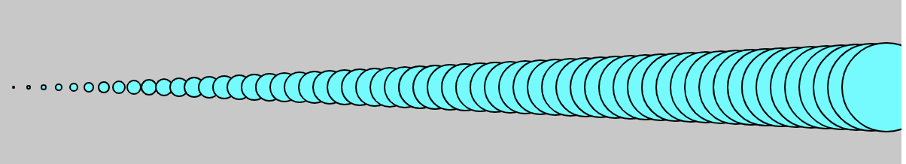
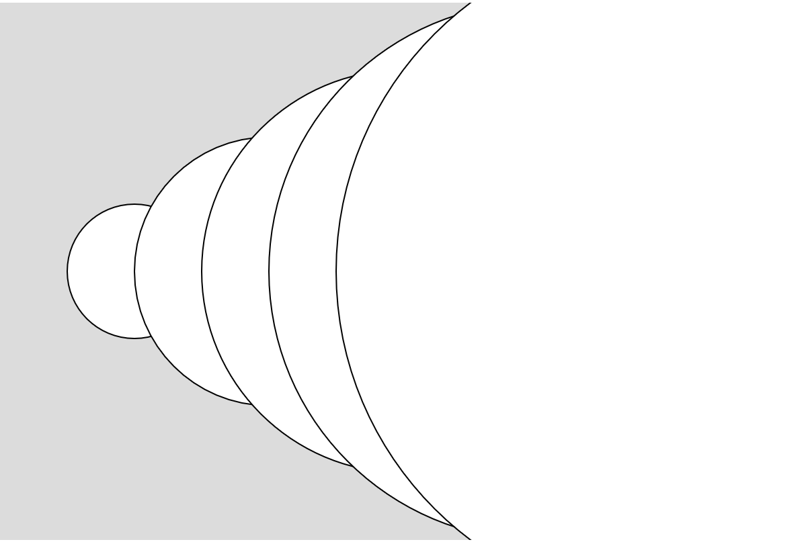
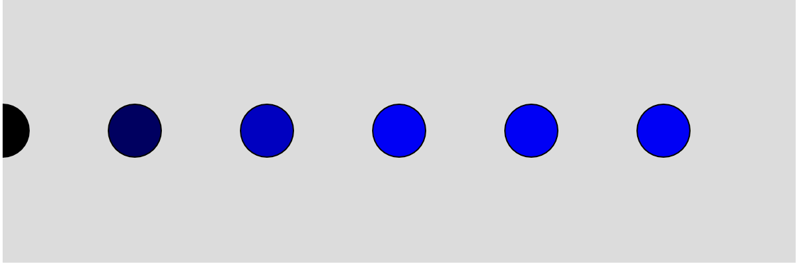
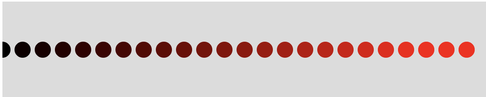
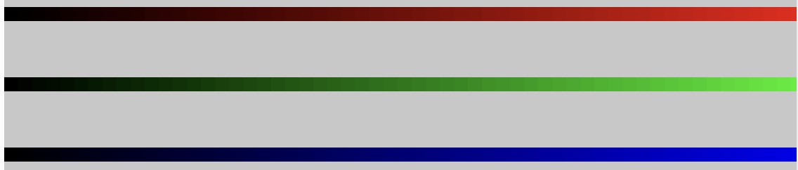
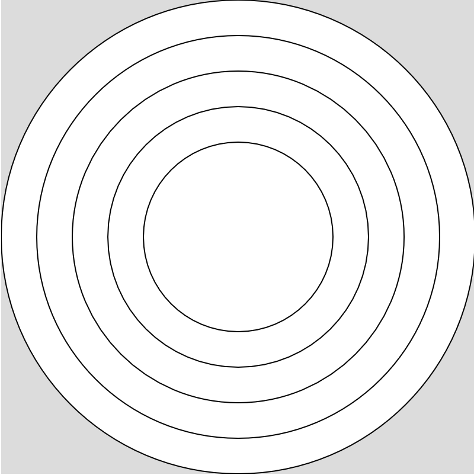
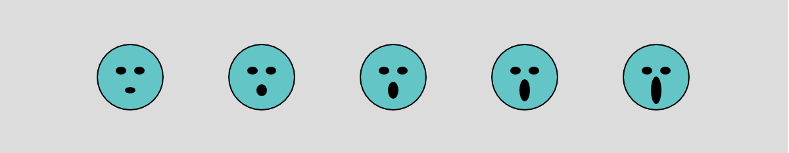
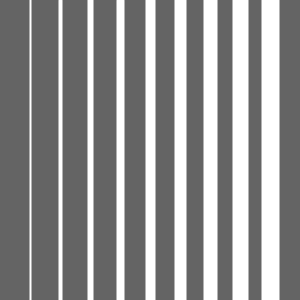
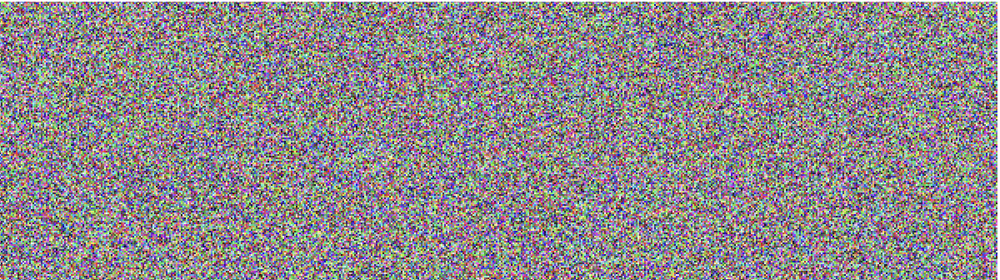

# Variation in For Loops

## Tasks

1. Using a for loop, draw 5 circles that get progressively larger as they move across the page.

1. Using a for loop, draw circles that are spaced 10 pixels apart. They should get progressively larger as they move acorss the page, but at 1/10th the rate (e.g If you move 10 pixels, then it should be 1 pixel larger).

2. Have the circle get larger as you move across the page. The circle should grow at the same rate as you move across the page (e.g. if you move 10 pixels, then it should be 10 pixels larger as well).

3. Have the circle become progressively more blue as it moves across the page. It should be completely blue when it reaches the edge of the page.

4. Have the circle become progressively more red as it moves across the page. These circles should be smaller than the ones that were drawn in Challenge 3 in order to show a more progressive change in color.

5. Create three bands that become progressively more red, green, and blue as they move across the page. **HINT**: Make a rectangle that has `noStroke()` and is 1 pixel in width inside your for loop.

6. Create 5 ellipses that get progressively smaller inside the same for loop. Create a variable that can be updated to alter the size of the width and height with each iteration.

7. Create a smiley face that gets a progressively larger mouth as the program draws from left to right. 

8. Use the `line` function to draw lines from the top of the page to the bottom of the page that get progressively thinker as the program moves from left to right.

**STRETCH**: Write a program that makes every pixel in the window a different random color. **HINTS**: Do this in the setup rather than the draw. Research "nested for loops" for how you can iterate through and draw a point at every x and y coordinate value. Stuck? Think about how you can do it for a single row first.

